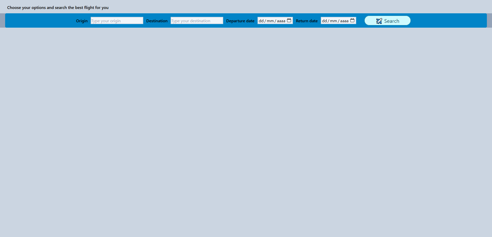
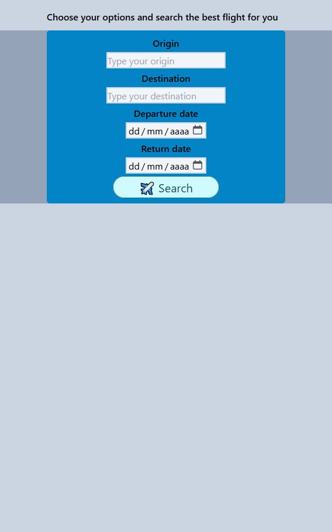

# Flight Search App

Flight Search App is a website that, when the user inputs their destination, origin place, dates, and shows flights options with currency exchange info.

## User Story

As a frequent traveler … 
I WANT to easily look for flights that match several criteria like: origin place, destination, departure date, and return date. 
I WANT to see the currency exchange of the destination place.

## Acceptance Criteria

WHEN the User opens the Flight Search App. 
THEN a landing page with a START BUTTON will be loaded.

WHEN the user clicks on the start button. 
THEN a second page will be shown with the following inputs: origin place, destination, departure date, and return date.

WHEN all inputs are in place and a SEARCH BUTTON is clicked. 
THEN the results will display the best option information, the cheapest option information, the fastest option information, and the direct option information. Also, the currency exchange information of the chosen destination will be displayed.

## APIs to be used
Currencies And Countries API, Skyscanner API, Openwheathermap API, and GeoDB Cities API

## Mock Up

## MVP

The Flight App works in a way that the user starts in the landing page, where they can click on the Let's Go button.

The user will be directed into the Serch Page.

If the user doesn't write any input, a message will remind the user to fill out all the inputs.

Once the user fill out all the inputs, information of their flight will be displayed in three categories: best, cheapest, and fastest.

If there are no flights available for the chosen dates or destination, a message will display to let the user know about it.